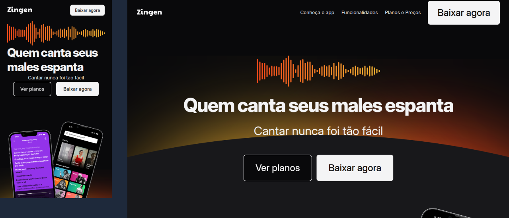

# 🎵 Zingen

Projeto desenvolvido durante os estudos na **Rocketseat** com foco em **HTML e CSS**, onde pratiquei conceitos importantes como **estrutura semântica, estilização moderna e design responsivo**.

---

## 🧠 Sobre o projeto

O **Zingen** é uma landing page fictícia inspirada em uma plataforma de streaming musical. Esse projeto foi essencial para reforçar meu entendimento sobre:

- 📐 Estruturação de conteúdo com HTML5
- 🎨 Estilização com CSS3 moderno
- 📱 Técnicas de **responsividade** para múltiplas telas
- 💡 Organização de código com boas práticas

Tudo feito com carinho, atenção aos detalhes e aquela vontade de sempre aprender mais!

---

## 💻 Tecnologias utilizadas

- HTML5
- CSS3 (Flexbox e Media Queries)
- Fonte personalizada via Google Fonts

---

## 📸 Preview



> 💡 Se estiver vendo pelo celular, abra o projeto em um navegador para visualizar o layout responsivo em ação!

---

## 🚀 Como visualizar

Você pode acessar o projeto diretamente pelo GitHub Pages:

👉 [Clique aqui para acessar](https://ghutttyerrez.github.io/zingen/)

Ou clonar e rodar localmente:

```bash
git clone https://github.com/ghutttyerrez/zingen.git
cd zingen
# basta abrir o index.html no seu navegador
